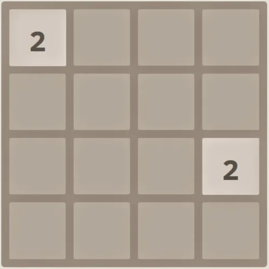
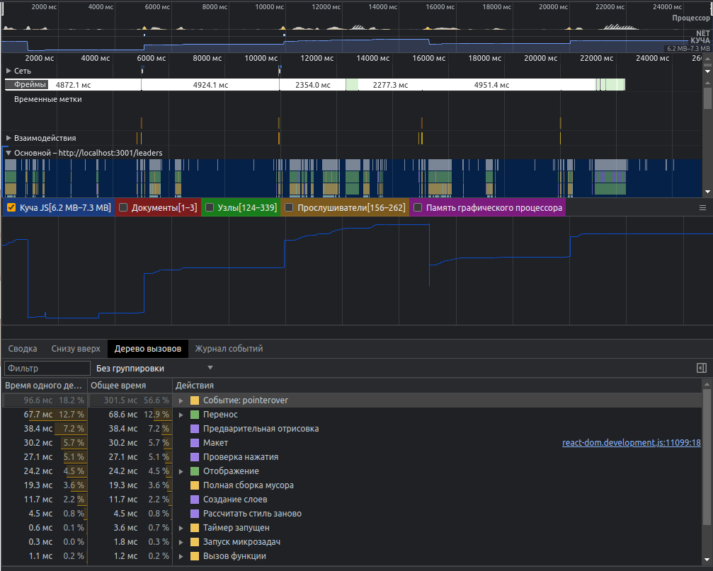

### Как запускать?

1. Убедитесь что у вас установлен `node` и `docker`
2. Выполните команду `yarn bootstrap` - это обязательный шаг, без него ничего работать не будет :)
3. Выполните команду `yarn dev`
4. Выполните команду `yarn dev --scope=client` чтобы запустить только клиент
5. Выполните команду `yarn dev --scope=server` чтобы запустить только server

#### Игровая карта: поле из 16 плиток размером 4\*4:

#### Цель игры: получение плитки номиналом «2048»

#### Управление: нажатие четырех клавиш клавиатуры (вверх, вниз, вправо, влево)

### Правила игры:

1. В каждом раунде появляется плитка номинала «2» (с вероятностью 90%) или «4» (с вероятностью 10%);
2. Нажатием стрелки игрок может скинуть все плитки игрового поля в одну из 4 сторон. Если при сбрасывании две плитки одного номинала «налетают» одна на другую, то они превращаются в одну, номинал которой равен сумме соединившихся плиток. После каждого хода на свободной секции поля появляется новая плитка номиналом «2» или «4». Если при нажатии кнопки местоположение плиток или их номинал не изменится, то ход не совершается;
3. Если в одной строчке или в одном столбце находится более двух плиток одного номинала, то при сбрасывании они начинают соединяться с той стороны, в которую были направлены. Например, находящиеся в одной строке плитки (4, 4, 4) после хода влево превратятся в (8, 4), а после хода вправо — в (4, 8);
4. За каждое соединение игровые очки увеличиваются на номинал получившейся плитки;
5. Игра заканчивается поражением, если после очередного хода невозможно совершить действие.

### DataBase

#### Запуск

все сервисы: docker-compose up
по одному сервису: docker-compose up SERVICE_NAME

#### PostgreSQL

переменные окружение описываются в .env
POSTGRES_USER=postrgre - имя пользователя
POSTGRES_PASSWORD=postgres - пароль
POSTGRES_DB=womba - имя дефолтной БД
POSTGRES_PORT=5432 - порт работы сервера БД

#### PgAdmin

Запускается после запуска PostgreSQL
переменные окружение описываются в .env
PGADMIN_DEFAULT_EMAIL=admin@womba.com - имя пользователя
PGADMIN_DEFAULT_PASSWORD=admin - пароль
PGADMIN_LISTEN_PORT=80 - порт внутри контейнера
PGADMIN_EXTERNAL_LISTEN_PORT=8080 - порт снаружи

#### memoryleaks

При тестировании приложения на учтечки памяти, учтечек не было обнаружено
